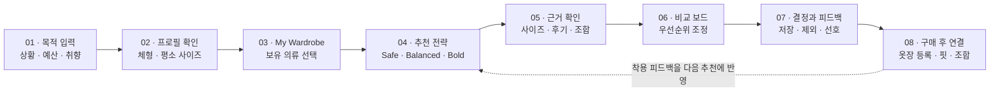
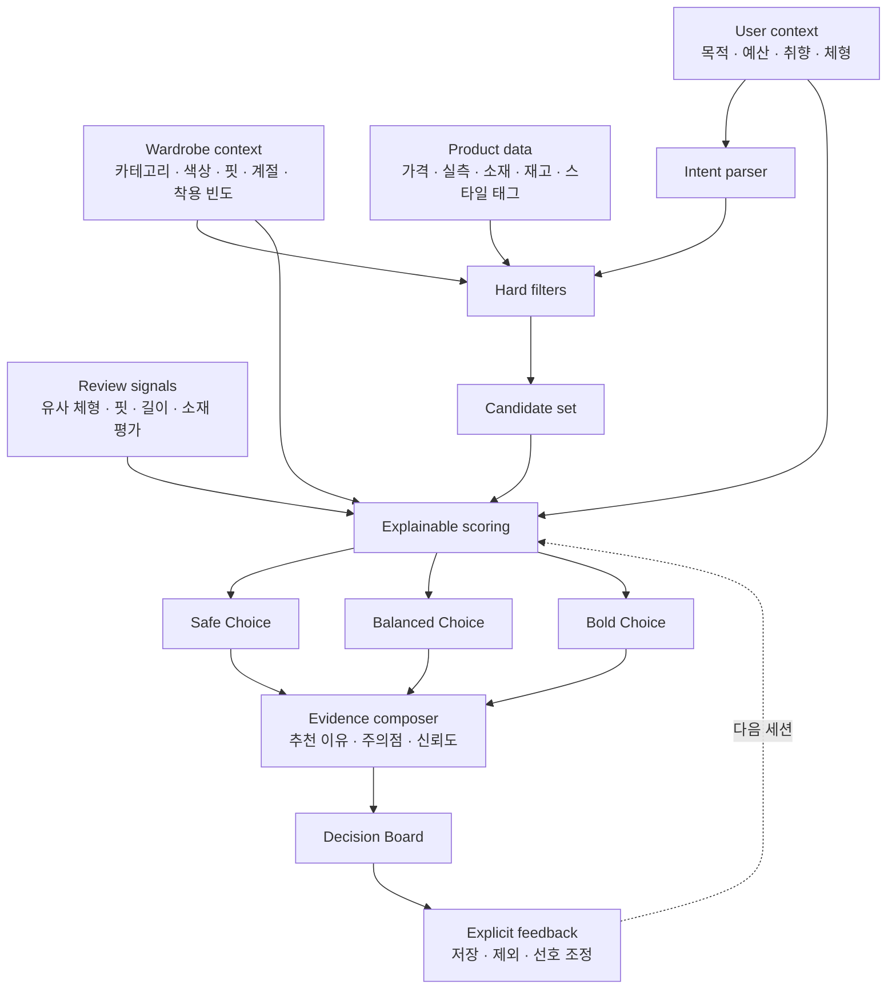

<div align="center">

<p><strong>FITWISE</strong></p>

# DON'T SEARCH MORE.<br />DECIDE BETTER.

### 상황과 체형을 이해하는 설명 가능한 AI 패션 의사결정 서비스

상품을 더 많이 보여주는 대신, 사용자가 더 적은 탐색으로<br />자신에게 맞는 옷을 확신 있게 선택하도록 돕습니다.

<br />


</div>

---

## 01. The problem

온라인 패션 쇼핑에서 사용자는 상품을 발견한 뒤에도 여러 상세 페이지, 사이즈표, 후기와 가격을 반복해서 비교합니다. 문제는 상품의 수가 아니라 **내 상황과 체형에 맞는 선택인지 판단할 근거가 흩어져 있다는 것**입니다.

FITWISE는 검색, 후기 탐색, 사이즈 고민과 상품 비교를 하나의 설명 가능한 의사결정 흐름으로 연결합니다.

> **Product hypothesis**
> 목적·체형·예산과 유사 체형 리뷰를 함께 분석해 추천 이유와 신뢰도를 제공하면, 구매 결정 시간은 줄고 선택 확신도는 높아질 것이다.

[문제 정의 자세히 보기 →](docs/product/problem.md) · [제품 전략과 사업 가설 →](docs/product/product-strategy.md)

---

## 02. The experience

| 01 — Tell us why | 02 — See the reasoning | 03 — Compare with confidence |
|---|---|---|
| 상황, 예산, 취향과 체형을 입력합니다. | 추천 상품뿐 아니라 추천 이유와 주의점을 확인합니다. | 목적별 점수와 우선순위를 조정해 최종 후보를 결정합니다. |

```text
"다음 주 첫 출근에 입을 옷이 필요해요.
 너무 정장 같지는 않았으면 좋겠고,
 예산은 20만 원이에요."
```

결과는 무한 상품 목록이 아니라 세 가지 전략으로 제안합니다.

| SAFE CHOICE | BALANCED CHOICE | BOLD CHOICE |
|---|---|---|
| 실패 가능성을 낮춘 선택 | 가격과 스타일의 균형 | 취향을 더 선명하게 표현 |

---

## 03. App flow

FITWISE의 핵심 흐름은 상품을 먼저 보여주는 대신, 사용자의 목적과 이미 가진 옷을 먼저 이해하는 것에서 시작합니다.



### Example journey

| Step | User action | FITWISE response |
|---|---|---|
| 1 | “첫 출근에 입을 옷, 예산 20만 원”이라고 입력 | 목적, 분위기, 예산과 회피 조건을 구조화 |
| 2 | 체형과 평소 사이즈를 확인 | 브랜드별 사이즈 후보와 불확실성 계산 |
| 3 | 옷장에서 검정 와이드 팬츠를 선택 | 새로 살 필요가 없는 하의는 제외하고 조합 가능한 상의를 탐색 |
| 4 | Safe·Balanced·Bold 결과 확인 | 상품, 추천 이유, 예상 활용도와 주의점 제공 |
| 5 | 가격과 활용도의 중요도를 조정 | 비교 순위와 설명을 즉시 재계산 |
| 6 | 후보를 저장하거나 제외 | 명시적 피드백을 다음 추천에 반영 |
| 7 | 구매한 옷을 My Wardrobe에 연결 | 실제 핏, 기존 옷과의 조합, 활용도와 중복 위험 분석 |

---

## 04. Core features

### Intent-first discovery

자연어로 입력한 목적, 예산, 선호 스타일과 회피 조건을 검색 가능한 기준으로 변환합니다. 변환된 조건은 사용자가 직접 확인하고 수정할 수 있습니다.

### Size confidence

신체 정보, 평소 착용 사이즈, 상품 실측과 유사 체형 후기를 조합해 추천 사이즈와 신뢰도를 제공합니다. 결과만 제시하지 않고 판단 근거와 불확실성을 함께 보여줍니다.

### Review Lens

전체 후기 평균보다 사용자와 비슷한 체형의 경험을 우선합니다. 핏, 소재, 길이와 색감처럼 구매 결정에 필요한 내용을 속성별로 요약합니다.

### My Wardrobe

사용자가 보유한 옷의 카테고리, 색상, 핏, 소재, 계절과 착용 빈도를 저장합니다. 추천 시 이미 가진 옷과의 조합 가능성, 중복 구매 가능성, 예상 활용도를 함께 계산합니다. 사진은 선택 사항이며 직접 입력과 빠른 태그 수정을 기본으로 제공합니다.

### Decision Board

가격, 목적 적합도, 사이즈 신뢰도, 보유 의류와의 조합 가능성을 한 화면에서 비교합니다. 사용자가 기준의 중요도를 변경하면 순위와 설명도 함께 바뀝니다.

---

## 05. Recommendation pipeline

AI가 모든 결정을 한 번에 생성하지 않습니다. 명확한 조건 필터링과 점수 계산을 먼저 수행하고, AI는 의도 구조화와 설명·요약에 제한적으로 사용합니다.



### Initial scoring model

```text
final_score =
  occasion_fit       × 0.25 +
  wardrobe_match     × 0.25 +
  size_confidence    × 0.20 +
  preference_match   × 0.15 +
  budget_fit         × 0.10 +
  review_quality     × 0.05
```

가중치는 초기 가설이며 사용자 테스트를 통해 조정합니다. 모든 점수는 구성 요소와 근거를 함께 노출하고, 데이터가 부족하면 낮은 신뢰도로 표시합니다.

[추천 파이프라인 자세히 보기 →](docs/architecture/recommendation-pipeline.md) · [상품 카탈로그 수집 전략 →](docs/architecture/product-catalog-ingestion.md) · [My Wardrobe 설계 보기 →](docs/product/my-wardrobe.md) · [제품 전략과 사업 가설 →](docs/product/product-strategy.md)

---

## 06. Design direction

FITWISE는 패션 에디토리얼의 절제된 분위기와 의사결정 도구의 명확성을 결합합니다.

| Principle | Application |
|---|---|
| Editorial, not decorative | 큰 이미지, 강한 타이포그래피, 넓은 여백 |
| Evidence before persuasion | 추천 점수보다 근거와 주의점을 우선 표시 |
| Less, but relevant | 무한 목록 대신 목적이 분명한 소수의 선택지 제공 |
| Confidence with honesty | 불확실한 결과는 신뢰도와 함께 표현 |
| Mobile first | 한 손 탐색과 짧은 의사결정 흐름을 기준으로 설계 |

**Palette**

`#111111` Ink · `#F7F7F4` Canvas · `#FFFFFF` Surface · `#D9D9D4` Line · `#D8FF3E` Signal

[비주얼 시스템 자세히 보기 →](docs/design/visual-system.md)

---

## 07. Planned stack


| Layer | Plan |
|---|---|
| App | Expo · React Native · TypeScript |
| Web expansion | Next.js · TypeScript · Tailwind CSS |
| API | FastAPI · Python |
| Data | PostgreSQL · pgvector |
| Auth & Storage | Supabase |
| Quality | Vitest · Pytest · Playwright |
| Delivery | Docker · GitHub Actions |

> The stack is a working proposal and may change after product discovery.

현재는 앱 우선으로 [`검색 → 추천 결과` 기술 프로토타입](docs/architecture/mobile-search-prototype.md)을 구성한다. 합성 상품으로 API 계약과 사용 흐름만 검증하며, 설문 결과 전에는 추천 정확도나 기능 우선순위가 검증됐다고 판단하지 않는다.

---

## 08. Roadmap

> **Execution plan** · 2026-10-08부터 2027-03-10까지 진행하는 [22주 주차별 과제](tasks/ROADMAP.md)를 기준으로 매주 산출물과 완료 조건을 점검합니다. 현재 과제는 [`tasks/CURRENT.md`](tasks/CURRENT.md)에서 확인합니다.

| Phase | Focus | Deliverable |
|---|---|---|
| 01 · Discovery | 사용자 문제와 시장 조사 | 인터뷰, 문제 정의, 성공 지표 |
| 02 · Prototype | 핵심 흐름과 비주얼 시스템 | Figma 프로토타입, 사용성 테스트 |
| 03 · Foundation | 제품 기반 구축 | 인증, 상품 탐색, My Wardrobe |
| 04 · Decision Engine | 설명 가능한 추천 | 의도 추출, 추천 근거, 비교 보드 |
| 05 · Review Lens | 체형 기반 후기 분석 | 유사 후기, 속성 요약, 신뢰도 |
| 06 · Launch | 품질 검증과 공개 | E2E 테스트, 성능 측정, 데모 |

현재 단계는 **01 · Product Discovery**입니다. 구현보다 문제 검증과 제품 범위 확정을 우선합니다.

---

## 09. Success metrics

| Metric | What it measures |
|---|---|
| Time to decision | 구매 후보를 결정할 때까지 걸린 시간 |
| Products inspected | 결정 전 확인한 상품 상세 페이지 수 |
| Size confidence | 사용자가 느끼는 사이즈 선택 확신도 |
| Reason comprehension | 추천 근거를 이해한 사용자 비율 |
| Decision completion | 비교 후 하나의 후보를 선택한 비율 |
| Wardrobe utilization | 추천 결과 중 보유 의류와 조합 가능한 비율 |
| Duplicate avoidance | 사용자가 중복 구매 후보를 발견·제외한 횟수 |
| Product outbound rate | 추천 결과에서 상품 상세 또는 구매처로 이동한 비율 |
| Wardrobe connection | 선택한 상품을 옷장과 구매 후 분석에 연결한 비율 |
| Reuse intent | 다음 구매에도 FITWISE를 사용하려는 비율 |

측정 전 수치를 성과처럼 제시하지 않습니다. 사용자 테스트 이후 실제 결과와 한계를 함께 공개합니다.

---

## 10. Documentation

| Document | Purpose | Status |
|---|---|---|
| [Problem statement](docs/product/problem.md) | 문제, 가설, 검증 기준 | Draft |
| [Product strategy](docs/product/product-strategy.md) | 차별화, 제품 루프, 사업 모델 가설 | Draft |
| [Competitive analysis framework](docs/research/competitive-analysis-framework.md) | 경쟁 서비스와 사업성 평가 기준 | Draft |
| [Survey questionnaire](docs/research/survey-questionnaire.md) | 공개 설문 문항과 분석 계획 | Active |
| [Visual system](docs/design/visual-system.md) | 색상, 서체, 레이아웃 원칙 | Draft |
| [My Wardrobe](docs/product/my-wardrobe.md) | 옷장 데이터와 추천 활용 방식 | Draft |
| [Recommendation pipeline](docs/architecture/recommendation-pipeline.md) | 후보 생성, 점수와 설명 흐름 | Draft |
| [Product catalog ingestion](docs/architecture/product-catalog-ingestion.md) | 공식 피드·API 수집, 정규화, 최신성과 권리 정책 | Draft |
| [App foundation](docs/architecture/app-foundation.md) | 앱 기술 스택, 저장소 경계, 데이터 모델과 도입 순서 | Draft |
| [Error management](docs/operations/error-management.md) | 오류 수집, 분류, 수정·재검증과 Error Center 기준 | Active |
| [WOOYOUNG PROJECT OS 점검 기록](docs/operations/project-os-dashboard.md) | 프로젝트 홈 구현 범위, 연결 저장소, 동작 점검과 제한사항 | Active |
| Product requirements | MVP 요구사항과 제외 범위 | Planned |
| User research | 인터뷰 계획과 결과 | Planned |
| Data dictionary & ERD v0 | 데이터 정의, 소유권, 민감도와 삭제 규칙 | Planned |

---

## 11. Project policy

이 저장소는 패션 커머스 사용자 경험을 연구하기 위한 독립적인 포트폴리오 프로젝트입니다. 특정 기업의 공식 프로젝트가 아니며, 상표·상품 정보·사용자 데이터를 무단으로 수집하거나 복제하지 않습니다. 데모 데이터는 사용 권한이 확인된 자료 또는 합성 데이터만 사용합니다.

<br />

<div align="center">

**FITWISE** · Explainable fashion decisions

</div>
