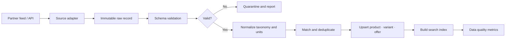

# Product Catalog Ingestion

## Goal

FITWISE는 세상의 모든 의류를 직접 보유하는 카탈로그를 목표로 하지 않는다. 사용 권한이 확인된 브랜드·판매처의 상품을 공통 형식으로 정규화하고, 사용자 조건에 맞는 소수 후보를 정밀하게 분석하는 상품 데이터 계층을 만든다.

핵심 원칙은 다음과 같다.

- 무단 크롤링을 상품 공급 전략으로 사용하지 않는다.
- 앱이 외부 브랜드 API를 직접 호출하지 않는다.
- 검색용 정보와 사이즈·핏 판단용 정보를 분리한다.
- 가격·재고·실측은 생성형 AI가 만들거나 추정하지 않는다.
- 모든 외부 필드에 출처, 수집 시각, 사용 범위와 만료 시각을 추적한다.
- 카탈로그 규모보다 데이터 완전성과 추천 근거 품질을 우선한다.

## Data source strategy

| Priority | Source | Use | Limitation |
|---:|---|---|---|
| 1 | 브랜드·판매처 공식 CSV/XML/JSON 피드 | 운영 카탈로그, 가격·재고·변형 동기화 | 계약과 데이터 품질 관리 필요 |
| 2 | 제휴 판매처 API | 실시간 또는 증분 상품 동기화 | 판매처별 인증·스키마·호출 제한 |
| 3 | 공식 쇼핑 검색 API | 사용자 질의 시 후보 발견 | 전체 카탈로그 복제와 장기 저장 용도로 간주하지 않음 |
| 4 | 허가된 공개·합성 데이터 | MVP 추천 흐름과 평가셋 | 실제 상품 최신성·구매 전환 검증 불가 |
| 5 | 사용자 직접 입력 | 구매 후 옷장과 개인 상품 기록 | 공용 판매 카탈로그로 재배포하지 않음 |

### Feed compatibility

파트너 피드는 Google Merchant 상품 규격과 호환되는 필드를 우선 지원한다. 이 규격은 상품 ID, 링크, 이미지, 가격, 재고, 브랜드, 색상, 소재, 사이즈, 사이즈 체계와 변형 그룹을 표현한다.

- Product data specification: <https://support.google.com/merchants/answer/7052112?hl=en>
- Variant grouping: <https://support.google.com/merchants/answer/6324507?hl=en>

Google Merchant API는 제3자 전체 카탈로그 조회 수단이 아니라 판매자가 자신의 Merchant Center 상품을 관리하는 API다. 파트너가 접근을 허용한 계정·피드에만 사용한다.

- Merchant Products API: <https://developers.google.com/merchant/api/guides/products/overview>

Shopify Storefront API도 Shopify 전체 상품을 제공하지 않는다. 각 파트너 상점이 발급한 접근 권한으로 해당 상점의 공개 카탈로그를 페이지 단위로 가져온다.

- Shopify products query: <https://shopify.dev/docs/api/storefront/latest/queries/products>

네이버 쇼핑 검색 API는 검색 후보 발견용 어댑터로 검토할 수 있다. 저장·이미지 표시·재배포 범위는 적용되는 약관을 별도로 검토하고, API 결과를 FITWISE 소유 카탈로그처럼 영구 복제하지 않는다.

- Naver Shopping Search API: <https://developers.naver.com/docs/serviceapi/search/shopping/shopping.md>

## Search data and decision-grade data

외부 검색 결과만으로는 FITWISE의 사이즈·핏 추천을 만들 수 없다. 두 데이터 수준을 명시적으로 구분한다.

| Data level | Typical fields | Purpose |
|---|---|---|
| Discovery | 상품명, 브랜드, 카테고리, 가격, 대표 이미지, 판매 링크 | 후보 발견과 외부 이동 |
| Decision grade | 색상, 소재, 실루엣, 변형, 사이즈별 실측, 신축성, 스타일·상황 태그 | 필터, 핏·옷장 점수와 추천 근거 |

의사결정 등급 데이터가 부족하면 낮은 신뢰도와 누락 항목을 표시한다. 검색 데이터만 있는 상품에 정밀한 핏 추천을 생성하지 않는다.

## Canonical data model

```text
brand
├── id
├── name
└── source_policy

product
├── id
├── brand_id
├── title
├── category_id
├── description
├── materials[]
├── style_tags[]
└── source_quality

product_variant
├── id
├── product_id
├── external_sku
├── color
├── size_label
├── size_system
└── image_refs[]

size_measurement
├── variant_id
├── body_part
├── value
├── unit
└── measurement_method

offer
├── id
├── variant_id
├── merchant_id
├── price
├── currency
├── availability
├── purchase_url
└── observed_at

source_record
├── source
├── external_id
├── raw_payload_ref
├── usage_scope
├── fetched_at
├── expires_at
└── checksum
```

상품과 판매 정보를 분리한다. 동일 상품이 여러 판매처에 존재해도 `product`와 `variant`는 공유하고 가격·재고·구매 링크는 `offer`로 관리한다.

## Ingestion pipeline



각 공급처는 같은 내부 계약을 구현한다.

```text
fetch(cursor) -> RawProductBatch
validate(raw) -> ValidationResult
normalize(raw) -> CanonicalProduct
checkpoint(cursor, checksum)
```

- 원본 레코드를 먼저 저장해 변환 오류를 재현할 수 있게 한다.
- 잘못된 상품은 전체 배치를 실패시키지 않고 격리한다.
- 공급처 ID와 체크섬으로 동일 데이터를 중복 처리하지 않는다.
- 삭제·품절·가격 변경을 일반 상품 갱신과 구분한다.

## Query-time retrieval

사용자 요청마다 전체 상품을 AI에 전달하지 않는다.

```text
자연어 조건 구조화
→ 카테고리·예산·재고·사이즈 하드 필터
→ 텍스트·태그 검색으로 후보 30~50개
→ 의사결정 등급 데이터가 있는 후보 우선
→ 체형·상황·옷장 점수 계산
→ Safe · Balanced · Bold 후보 3개
→ 근거·주의점·신뢰도 구성
```

자연어 모델은 후보 검색식을 만들거나 설명을 구성할 수 있지만 가격, 재고, 실측과 필터 통과 여부의 최종 판단은 구조화 데이터와 결정적 코드가 담당한다.

## Freshness and rights

- 가격·재고·판매 링크에는 `observed_at`과 만료 정책을 둔다.
- 만료된 offer는 숨기거나 `확인 필요`로 표시하고 추천 점수에서 제외한다.
- 상품 이미지의 복사·캐시·변환 가능 범위를 공급처별로 기록한다.
- 허가되지 않은 이미지는 자체 저장소에 복제하지 않는다.
- 사용자 업로드 이미지는 공용 상품 데이터와 분리하고 삭제 기능을 제공한다.
- 공급 계약 종료 시 해당 공급처의 이미지·상품·검색 인덱스를 회수할 수 있어야 한다.

## Delivery stages

### Stage 0 — Core prototype

- 합성 또는 사용 허가가 확인된 3~5개 브랜드
- 200~500개 상품과 대표 변형
- CSV import와 검증 리포트
- 사이즈 실측과 출처가 있는 상품만 핏 추천에 사용

### Stage 1 — Partner pilot

- 소규모 브랜드 또는 판매처 1곳
- Shopify API 또는 Merchant 호환 피드 어댑터
- 추가·변경·품절 증분 동기화
- 데이터 누락과 갱신 실패 알림

### Stage 2 — Multi-source catalog

- 공급처별 커넥터와 작업 큐
- 상품·변형·offer 중복 판별
- 공식 검색 API를 후보 발견에 제한적으로 사용
- 공급처·카테고리별 품질 대시보드

### Stage 3 — Scale

- 검색 부하와 데이터량이 PostgreSQL 기준을 넘을 때 OpenSearch 검토
- 파티셔닝, 증분 인덱싱과 실패 재처리
- 가격·재고 최신성 SLO와 공급처별 장애 격리

## Quality gates

- 필수 필드 누락률과 변형 연결 실패율을 측정한다.
- 가격·재고·실측의 출처 없는 값을 운영 카탈로그에 허용하지 않는다.
- 동일 공급처 배치를 재처리해도 중복 상품이 생성되지 않는다.
- 만료된 offer가 추천 후보에 포함되지 않는다.
- 상품 삭제와 공급 계약 종료를 검색 인덱스까지 전파한다.
- 공급처 장애가 핵심 추천 API 전체 장애로 이어지지 않는다.

## MVP non-goals

- 모든 국내 패션 상품 수집
- 무단 상세 페이지·리뷰·이미지 크롤링
- 실시간으로 모든 판매처의 최저가 보장
- 데이터가 없는 상품의 사이즈 실측 추정
- 초기 단계의 완전 자동 상품 중복 병합
