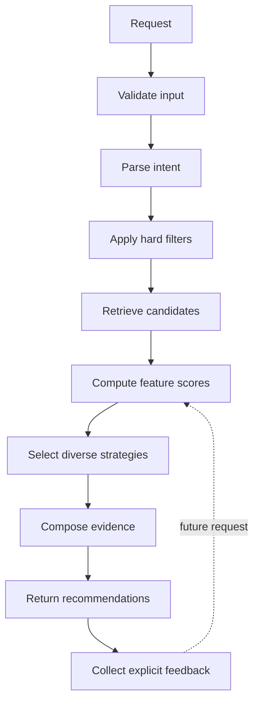

# Recommendation Pipeline

## Goal

추천 파이프라인은 상품을 많이 노출하는 대신, 사용자의 목적과 보유 의류에 맞는 소수의 후보를 근거와 함께 제공한다. 생성형 AI가 가격, 재고 또는 사이즈 사실을 임의로 만들지 않도록 구조화된 계산과 생성 단계를 분리한다.

## Pipeline



## 1. Validate input

- 예산의 최소·최대값을 검사한다.
- 지원하는 카테고리와 목적을 확인한다.
- 체형 또는 옷장 정보가 없어도 요청을 허용한다.
- 신뢰할 수 없는 자유 텍스트는 실행 가능한 명령으로 취급하지 않는다.

## 2. Parse intent

자유 텍스트를 다음과 같은 구조로 변환한다.

```json
{
  "occasion": "first_day_at_work",
  "budget_max": 200000,
  "styles": ["minimal", "smart_casual"],
  "avoid": ["large_logo", "slim_fit"],
  "required_categories": ["top", "outerwear"],
  "wardrobe_item_ids": ["black-wide-pants"]
}
```

파싱 결과는 추천 전에 사용자가 확인하고 수정할 수 있어야 한다.

## 3. Hard filters

명확한 제약은 점수화하지 않고 후보에서 먼저 제외한다.

- 예산 초과
- 지원하지 않는 카테고리
- 사용자가 명시적으로 제외한 속성
- 선택할 수 없는 사이즈
- 재고 없음

## 4. Candidate retrieval

초기 버전은 구조화된 태그와 텍스트 검색을 조합한다. 데이터가 충분해진 이후 임베딩 기반 유사도 검색을 실험한다.

- 외부 검색 결과와 FITWISE가 사용 권한을 가진 운영 카탈로그를 구분한다.
- 가격·재고·실측의 출처와 최신성을 확인한 후보만 해당 근거에 사용한다.
- 검색 데이터만 있고 사이즈 실측이 없는 상품에는 정밀한 핏 추천을 생성하지 않는다.
- 전체 카탈로그를 생성형 모델에 전달하지 않고 하드 필터와 검색으로 후보를 먼저 축소한다.

[상품 카탈로그 수집 전략](product-catalog-ingestion.md)에서 공급처 연동, 정규화, 최신성과 권리 정책을 관리한다.

## 5. Feature scoring

| Signal | Inputs | Explanation example |
|---|---|---|
| Occasion fit | 목적·상품 태그 | 첫 출근과 세미캐주얼 조건에 적합 |
| Wardrobe match | 보유 옷·상품 속성 | 검정 와이드 팬츠와 조합 가능 |
| Size confidence | 신체 정보·실측·리뷰 | 유사 체형 리뷰 32개 기준 L 추천 |
| Preference match | 선호·제외·피드백 | 미니멀 선호와 큰 로고 제외 반영 |
| Budget fit | 가격·예산 | 총 예산의 72% 사용 |
| Review quality | 수량·일관성·최신성 | 핏 관련 평가가 충분하고 일관됨 |

## 6. Strategy selection

단일 점수 상위 3개가 아니라 서로 다른 전략을 대표하는 후보를 선택한다.

- Safe Choice: 사이즈 신뢰도와 목적 적합도를 우선
- Balanced Choice: 모든 기준의 균형과 가격 효율을 우선
- Bold Choice: 취향 적합도와 차별성을 우선하되 필수 제약은 유지

## 7. Evidence composition

설명은 계산된 구조화 데이터만 근거로 작성한다.

```text
추천 이유
- 첫 출근과 세미캐주얼 조건에 적합
- 선택한 검정 와이드 팬츠와 조합 가능
- 예산 안에서 아우터까지 구성 가능

주의할 점
- 유사 체형 리뷰에서 소매가 길다는 의견이 6건 있음
- 소재 정보가 부족해 신뢰도를 78%로 제한함
```

## 8. Feedback

클릭만으로 취향을 단정하지 않는다. 다음과 같은 명시적 피드백을 우선한다.

- 저장
- 추천에서 제외
- 비슷한 상품 더 보기
- 더 저렴하게
- 더 개성 있게
- 사이즈 추천이 맞음 또는 맞지 않음
- 구매함 또는 구매하지 않음
- 실제 착용감과 함께 입은 보유 의류

## Confidence

신뢰도는 모델의 자신감 표현이 아니라 이용 가능한 근거의 품질을 나타낸다.

- 상품 실측 데이터 완전성
- 유사 체형 리뷰의 수와 일관성
- 사용자 프로필 완성도
- 옷장 데이터의 최신성
- 추천 근거 간 충돌 여부

## Evaluation

### Offline

- 필터 조건 위반률
- 추천 다양성
- 설명과 계산 근거의 일치율
- 유사 체형 리뷰 검색 정확도
- 동일 입력에 대한 결과 안정성

### User test

- 구매 후보 결정 시간
- 선택 확신도
- 추천 근거 이해도
- 옷장 기반 추천의 유용성
- 기존 방식 대비 확인한 상품 수

## Failure handling

- 후보가 부족하면 조건을 몰래 완화하지 않고 사용자에게 알린다.
- 데이터가 부족하면 낮은 신뢰도와 부족한 근거를 표시한다.
- AI 요약이 실패해도 구조화된 점수와 원문 근거는 제공한다.
- 재고와 가격은 생성형 모델의 출력이 아니라 최신 상품 데이터만 사용한다.
