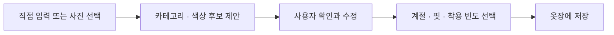

# My Wardrobe

## Purpose

My Wardrobe는 사용자가 이미 가진 옷을 추천의 핵심 입력으로 활용한다. 목표는 옷장 자체를 정교하게 관리하는 것이 아니라 다음 세 가지 질문에 더 잘 답하는 것이다.

1. 이 상품은 내가 가진 옷과 실제로 조합할 수 있는가?
2. 이미 비슷한 상품을 가지고 있지는 않은가?
3. 구매한다면 얼마나 자주 활용할 수 있는가?
4. 구매한 옷은 실제로 나에게 맞았고 다음 추천에 어떤 피드백을 남기는가?

## User value

- 기존 옷과 어울리는 상품을 우선 확인한다.
- 비슷한 색상·핏·용도의 중복 구매를 발견한다.
- 단품보다 완성된 조합을 기준으로 구매를 판단한다.
- 자주 입지 않는 옷을 활용하는 새로운 조합을 찾는다.
- 사용자의 실제 행동을 기반으로 선호를 점진적으로 개선한다.
- 구매 후 실제 착용감과 활용 피드백을 다음 사이즈·조합 추천에 반영한다.

## Post-purchase analysis

구매하거나 선택한 상품을 옷장에 연결하면 두 종류의 적합성을 분리해 보여준다.

### Physical fit

- 평소 착용 사이즈와 상품 실측의 차이
- 브랜드별 사이즈 편차
- 유사 체형 후기와 실제 착용 피드백
- 부위별 주의점과 데이터 품질 기반 신뢰도

초기에는 `맞는다`고 단정하지 않고 `M 추천 · 신뢰도 72% · 소매는 길 수 있음`처럼 근거와 불확실성을 표시한다.

### Context and wardrobe fit

- 함께 입을 수 있는 보유 의류와 가능한 조합 수
- 출근·데이트·모임 등 활용 가능한 상황
- 같은 카테고리·색상·용도의 중복 구매 위험
- 새 상품이 보완하는 옷장 공백

구매 전 예상과 구매 후 실제 피드백을 구분해 저장하고, 실제 피드백을 더 높은 품질의 신호로 사용한다.

## MVP input

사진 업로드를 강제하지 않는다. 빠른 직접 입력과 태그 선택을 기본으로 제공한다.

| Field | Example | Required |
|---|---|---|
| Category | 팬츠 | Yes |
| Subcategory | 와이드 팬츠 | Yes |
| Primary color | 블랙 | Yes |
| Fit | 와이드 | No |
| Season | 봄·가을 | No |
| Material | 코튼 | No |
| Brand | 사용자 입력 | No |
| Size | M / 30 | No |
| Wear frequency | 자주 입음 | No |
| Image | 사용자 사진 | No |
| Notes | 첫 출근에도 착용 가능 | No |

## Suggested data model

```text
wardrobe_item
├── id
├── user_id
├── category
├── subcategory
├── primary_color
├── secondary_colors[]
├── fit
├── seasons[]
├── materials[]
├── brand
├── size_label
├── wear_frequency
├── image_url
├── source              # manual | image_assisted
├── acquisition_source  # existing | purchased_after_recommendation | other
├── fit_feedback        # too_small | good | too_large | unknown
├── satisfaction
├── created_at
└── updated_at
```

MVP에서는 원본 이미지에서 신체 정보나 얼굴을 분석하지 않는다. 향후 이미지 분류를 추가하더라도 AI가 생성한 태그를 사용자가 확인하고 수정한 뒤 저장하게 한다.

## Registration flow



빠른 시작을 위해 첫 가입 시 모든 옷을 등록하게 하지 않는다. 추천에 사용할 대표 아이템 3~5개만 등록하도록 안내한다.

## Recommendation signals

### Wardrobe match

후보 상품이 선택한 보유 의류와 색상, 실루엣, 계절과 목적 측면에서 얼마나 조합 가능한지 계산한다.

### Duplicate risk

같은 카테고리, 유사 색상, 유사 핏과 용도를 가진 보유 의류가 있으면 중복 가능성을 표시한다. 자동으로 구매를 막지 않고 판단 근거만 제공한다.

```text
유사 아이템 2개를 이미 가지고 있어요.
새 상품은 소재와 기장 면에서 차이가 있습니다.
```

### Expected versatility

새 상품이 사용자의 보유 의류 몇 개와 조합 가능한지 추정한다.

```text
보유 아이템 12개 중 7개와 조합 가능
예상 활용도: 높음
```

### Underused item recovery

착용 빈도가 낮은 옷과 조합할 수 있는 상품을 제안해 기존 옷장의 활용도를 높인다. 이 기능은 충분한 데이터가 모인 이후 실험 기능으로 검증한다.

## Cold start

옷장 정보가 없는 사용자도 서비스를 사용할 수 있어야 한다.

- 기본 추천은 목적, 예산, 취향과 체형만 사용한다.
- 사용자가 결과를 저장하거나 제외하면 선호 신호로 활용한다.
- 옷장 등록이 추천에 어떤 도움을 주는지 먼저 설명한다.
- 대표 아이템 3개 등록 후 달라진 결과를 바로 보여준다.

## Privacy principles

- 옷장 사진은 선택 사항이다.
- 필요한 정보만 저장하고 수집 목적을 설명한다.
- 사용자가 항목과 사진을 개별 삭제할 수 있어야 한다.
- 원본 사진 보관 여부와 보관 기간을 명확히 표시한다.
- 얼굴이나 주변 배경은 추천 입력으로 사용하지 않는다.
- 개인 신체 정보와 옷장 데이터는 공개 프로필에 노출하지 않는다.
- 분석·추천 로그는 가능한 경우 식별 정보와 분리한다.

## MVP acceptance criteria

- 사용자는 사진 없이 옷을 등록할 수 있다.
- 등록한 옷을 수정하고 삭제할 수 있다.
- 추천 요청에서 사용할 보유 아이템을 선택할 수 있다.
- 추천 결과에 최소 하나의 옷장 기반 근거가 표시된다.
- 유사 아이템이 있으면 중복 가능성을 확인할 수 있다.
- 옷장 데이터가 없어도 전체 추천 흐름을 완료할 수 있다.
- 구매 후 실제 착용감과 활용 피드백을 선택적으로 기록할 수 있다.

## Later experiments

- 이미지에서 카테고리와 색상 태그 제안
- 옷장 기반 캡슐 컬렉션 구성
- 날씨와 일정에 따른 데일리 조합
- 착용 기록을 활용한 활용도 분석
- 새 상품 구매 전 옷장 변화 시뮬레이션
