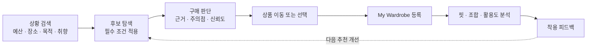

# FITWISE Product Strategy

## Positioning

FITWISE는 상품을 더 많이 보여주는 쇼핑몰이 아니다. 사용자가 자연어로 예산, 장소, 목적과 취향을 설명하면 구매 후보를 찾고, 그 상품이 신체·상황·기존 옷장에 맞는지 근거와 한계까지 설명하는 개인 패션 의사결정 서비스다.

> 상황을 말하면 살 옷을 찾고, 산 옷이 나에게 맞는지와 내 옷장에 어떻게 활용할지까지 설명한다.

## Why users should choose FITWISE

기존 패션 플랫폼이 자사 상품의 발견과 판매 전환에 집중한다면 FITWISE는 여러 후보를 동일한 기준으로 비교하고 최종 결정을 돕는 독립적인 의사결정 계층을 지향한다.

- 특정 쇼핑몰에 종속되지 않는 비교 기준
- 목적·예산·취향을 구조화하는 자연어 검색
- 추천 결과뿐 아니라 이유·주의점·신뢰도 제공
- 신체 적합성과 상황·스타일 적합성의 분리
- 보유 의류와의 조합 가능성, 예상 활용도와 중복 구매 위험 분석
- 구매·착용 피드백이 다음 추천을 개선하는 장기 개인화

초기 차별화의 중심은 **플랫폼 중립적인 비교**와 **설명 가능한 추천**이다. 추천 정확도를 근거 없이 주장하지 않고, 사용자가 더 빠르고 확신 있게 결정할 수 있는지를 행동 지표로 검증한다.

## Core product loop



구매 전 추천만 제공하면 사용자는 옷을 살 때만 방문한다. 구매 후 옷장·코디·착용 피드백까지 연결하면 다음 구매 전에 다시 돌아올 이유가 생긴다.

## Example journey

사용자 입력:

```text
15만 원 이하로 다음 주 회사 워크숍에서 입을 옷을 찾고 있어.
너무 딱딱하지 않았으면 좋겠고 평소 검은색 슬랙스를 자주 입어.
```

의도 파서가 확인할 조건:

| Field | Parsed value |
|---|---|
| Budget | 150,000원 이하 |
| Occasion | 회사 워크숍 |
| Style | 단정함, 낮은 격식 |
| Wardrobe context | 검은색 슬랙스 |
| Candidate category | 상의 또는 아우터 |

추천 결과는 상품명만 나열하지 않는다.

```text
이 네이비 셔츠 재킷은 검은색 슬랙스와 조합할 수 있고
워크숍과 평상복 모두 활용할 수 있습니다.

주의할 점
- 오버핏 상품이라 평소보다 한 사이즈 작은 후보도 확인해야 합니다.
- 소매 실측 데이터가 없어 사이즈 신뢰도는 68%입니다.
```

## Two kinds of fit

### Physical fit

신체 치수, 평소 착용 사이즈, 브랜드 사이즈표, 상품 실측, 유사 체형 후기와 구매 후 피드백으로 예상 착용감을 계산한다.

- 단정적인 `맞음/안 맞음` 대신 추천 사이즈와 신뢰도를 제공한다.
- 부족한 데이터와 충돌하는 근거를 함께 표시한다.
- 가격·재고·실측 같은 사실은 생성형 AI가 만들지 않는다.

### Context and style fit

장소, 목적, 색상, 실루엣, 계절, 날씨, 선호와 보유 의류를 기준으로 활용 가능성을 계산한다.

- 함께 입을 수 있는 보유 의류
- 만들 수 있는 조합 수와 예상 활용도
- 유사 아이템 보유에 따른 중복 위험
- 새 상품으로 보완되는 옷장 공백

## Business model hypotheses

수익 모델은 동시에 구현하지 않고 사용자 가치가 확인되는 순서로 검증한다.

| Stage | Model | Value exchange | Validation signal |
|---|---|---|---|
| 1 | 제휴 구매 수수료 | 무료 의사결정 지원 후 외부 쇼핑몰 이동 | 추천 결과의 상품 이동률과 구매 의향 |
| 2 | 프리미엄 구독 | 고급 옷장 분석, 코디, 개인 스타일 리포트 | 반복 사용과 유료 기능 선택 의향 |
| 3 | B2B API·SaaS | 쇼핑몰에 사이즈·비교·추천 근거 기능 제공 | 판매자 문제 인터뷰와 파일럿 의향 |

MVP는 실제 결제·주문·제휴 정산을 구현하지 않는다. 상품 이동과 구매 의향을 측정해 제휴 모델 가능성을 먼저 검증한다.

## Product and business hypotheses

| Type | Hypothesis | Evidence required |
|---|---|---|
| Desirability | 사용자는 상품 발견보다 최종 선택과 사이즈 판단에 더 큰 마찰을 겪는다. | 설문·인터뷰에서 반복되는 실제 행동 |
| Differentiation | 근거·주의점·옷장 조합을 함께 제공하면 기존 검색보다 FITWISE를 선택한다. | 비교 프로토타입 과제와 선택 이유 |
| Usability | 자연어 조건 확인과 소수 후보 비교를 사용자가 도움 없이 완료한다. | 사용성 테스트 성공률과 오류 |
| Retention | 구매 후 옷장 분석과 착용 피드백이 다음 방문 이유를 만든다. | 재방문 의향과 반복 과제 사용 |
| Viability | 추천이 상품 이동 또는 유료 고급 기능 의향으로 연결된다. | CTA 클릭, 구매 의향, 지불 의향 |
| Feasibility | 구조화 데이터와 설명 가능한 점수로 사실을 생성하지 않고 결과를 제공할 수 있다. | 평가셋, 필터 위반률, 근거 일치율 |

## Success metrics

### User value

- 구매 후보 결정 시간
- 결정 완료율
- 선택 확신도
- 추천 근거 이해도
- 확인한 상품 수
- 옷장 기반 조합의 유용성

### Retention and business

- 추천 결과에서 상품 상세로 이동한 비율
- 후보 저장 또는 옷장 등록 비율
- 다음 구매에도 다시 사용하겠다고 답한 비율
- 옷장 등록 후 두 번째 추천을 실행한 비율
- 프리미엄 기능 선택 또는 지불 의향

측정 전 수치를 성과처럼 제시하지 않는다. 4주차 PRD에서 기준선, 목표값, 이벤트와 실패 조건을 확정한다.

## MVP sequence

1. 자연어 조건 검색과 사용자의 조건 확인·수정
2. 근거·주의점·신뢰도가 포함된 소수 후보 비교
3. 대표 보유 의류 3~5개를 사용하는 My Wardrobe
4. 신체 적합성과 옷장 조합을 분리한 분석
5. 저장·제외·사이즈 적합 여부 같은 명시적 피드백

자동 쇼핑몰 계정 연동, 실제 주문·결제, AR 가상 착용과 무단 상품 수집은 MVP에서 제외한다. 기능 폭은 줄이되 인증, 권한, 개인정보, 평가, 관측성과 장애 대응의 품질 기준은 줄이지 않는다.

## Discovery decision gates

개발에 들어가기 전에 다음 질문에 근거로 답할 수 있어야 한다.

1. 첫 사용자는 누구이며 반복해서 겪는 결정 문제는 무엇인가?
2. 기존 서비스 대신 또는 함께 FITWISE를 사용할 구체적인 이유는 무엇인가?
3. 어떤 추천 근거가 결정 시간과 확신도를 실제로 개선하는가?
4. 사용자가 다음 구매에도 돌아올 이유는 무엇인가?
5. 초기 사용자 행동이 어떤 수익 가설로 연결되는가?
